# hyperresearch-codex

입력 패킷의 [실제 20회 결과와 품질 판정](docs/EFFICIENCY-RESULTS-20260914.md)을 공개했습니다. 소규모 고정 입력 실험이며 일반적인 절감·품질 향상은 입증되지 않았습니다.
토큰 절감과 품질의 후속 실측은 [사전 등록 실험 계획](docs/EFFICIENCY-STUDY-PROTOCOL.md)을 따릅니다. 실행 도구 준비와 실제 효과 입증은 구분합니다.

[](https://github.com/choisam4u-creator/hyperresearch-codex/actions/workflows/tests.yml) [](LICENSE)  

A Codex-only research pipeline that turns one prompt into a **sourced, adversarially reviewed brief** (not a 10,000-word survey — see the comparison in `docs/COMPARISON-drb67.html`). **Python orchestrates, `codex exec` judges, gates verify.**

Built by [samchoi](https://github.com/choisam4u-creator), inspired by [jordan-gibbs/hyperresearch](https://github.com/jordan-gibbs/hyperresearch) (MIT, Claude Code only). This is an independent implementation that shares no code or prompts: the orchestration moved into Python and every model call became a `codex exec` step.

**Status:** beta 0.3.1. 10 real runs on `gpt-6-astra` (4 full, 6 light), plus a mock test suite covering failure paths. The test count may change as the suite evolves; run the command below for the current count. Prompts will need tuning as Codex models change; the Korean README is [README.ko.md](README.ko.md).

## Three rules

1. **Python drives, the model works.** Step order, parallelism (max 2), retries and resume live in `hprc/pipeline.py` and a per-run `manifest.json`.
2. **Models only read; Python writes.** Every call is `codex exec -s read-only --output-schema …` inside a throwaway directory holding only that step's inputs. Edits come back as bounded find/replace hunks that Python applies.
3. **Every model output passes a gate.** Verbatim prompt preserved, unknown citations rejected, critic quotes must exist in the draft, patch ≤30 % and polish ≤15 % of the text, citation samples re-checked, citation markers never removed.

## How it compares

Upstream verification and usage-control entries checked 2026-09-14 at commit `75b1ecf`; other comparison entries retain the 2026-09-13 snapshot. Numbers for this tool are measured (see *Cost*); numbers for others come from their own READMEs or examples.

| | **hyperresearch-codex** (this) | [jordan-gibbs/hyperresearch](https://github.com/jordan-gibbs/hyperresearch) | [insane-research-codex](https://github.com/fivetaku/gptaku-plugins-codex) | ChatGPT Deep Research |
|---|---|---|---|---|
| Runs on | Codex CLI (subscription or API) + Python 3.11 | Claude Code; a Codex install path is in review upstream ([PR #63](https://github.com/jordan-gibbs/hyperresearch/pull/63), accepted in principle 2026-09-11) | Codex plugin marketplace (`codex plugin marketplace add …`) | ChatGPT app |
| Who drives the steps | Python. The model only judges, inside read-only `codex exec` calls with a JSON schema | Claude Code skill and sub-agents | Codex skill with helper scripts; can fan out research agents | the service |
| What you get | 1–3.5k-word sourced brief, provenance table, cite-check line; notes stay on disk in an FTS5 vault with a read-only MCP server | 10k-word survey (example report: 11,209 words, 97 sources) | citation-heavy report with a claim ledger, A–E source grades and `RESEARCH/` state | chat answer with citations |
| Verification you can inspect | unknown-citation gate, critic-quote gate, patch ≤30 % / polish ≤15 %, judgment markers, cite-check sample, lint | adversarial critique, citation binding audit, quote-integrity and retracted-citation ship gates | `validate_ledger.py` → `verify_report.py` → `eval_report.py` | none |
| Measured cost / time | light lean 0.53–0.69 M input tokens, 5–6 min; full lean 1.27 M, 11 min; full standard 2.58 M, 29 min | ~2 h per full run (author's example); tokens not published | not published | included in the subscription |
| Usage control | per-run budget stop + resume, token ledger, `--at HH:MM` reset scheduling | estimated USD budget, resume, per-step spend/time telemetry | – | – |
| Languages | Korean and English prompt sets | English | English (chat-first) | many |
| Pick it when | you want a reproducible, auditable brief from Codex in minutes and need to watch a subscription window | you use Claude Code and want the long survey | you want a one-line marketplace install and the richer phase model inside Codex | you want zero setup |

Upstream references: [run verification and budget code](https://github.com/jordan-gibbs/hyperresearch/blob/75b1ecfb2891184fad2cc1a2ddf9abe476f5b54c/src/hyperresearch/core/runs.py). This is a feature comparison, not a controlled report-quality benchmark.

New source notes use immutable snapshots with permanent IDs; each run keeps its own `S1` aliases in `sources.json`. Legacy notes remain readable. Previously overwritten content cannot be reconstructed automatically. Phase milestones are listed in [the development plan](docs/DEVELOPMENT-PHASES.md).

## Requirements

- Codex CLI, logged in (`codex login`). The published cost measurements used Codex CLI 0.153.4 and `gpt-6-astra`; other versions may need prompt tuning.
- `hpr doctor` verifies `codex --version` and `codex login status` with a timeout. A mismatch from the measured 0.153.4 is a non-blocking warning; version/query/login failures are shown clearly.
- Python 3.11+ with `httpx` and `pypdf` (installed by `pip install`). SQLite with FTS5 (standard on macOS and most Linux builds).
- macOS is the measured install and execution environment. Linux is covered by CI install, help, and mock checks only. Windows 3.12 passed installation, help, locking, mock run/resume and wheel smoke in [CI](https://github.com/choisam4u-creator/hyperresearch-codex/actions/runs/34766135191) (`PYTHONUTF8=1`). Four POSIX shell fixtures are skipped on Windows; actual Codex research remains unverified.

## 60-second start

```bash
pip install "git+https://github.com/choisam4u-creator/hyperresearch-codex"   # installs the `hpr` command (deps: httpx, pypdf)
# or: git clone https://github.com/choisam4u-creator/hyperresearch-codex && cd hyperresearch-codex && pip install .
hpr doctor                             # checks the Codex CLI, login, sqlite FTS5
hpr run "your question" --dry-run      # what will run, how many calls, rough cost
hpr run "your question"                # light tier: ~8 calls, progress prints live (Korean report by default)
hpr run "your question" --lang en      # English prompts and report
hpr run "your question" --preset lean  # subscription-friendly: 2 critics, 2 drafts, smaller caps (~40 % fewer tokens)
open research/runs/*/final_report.md
```

`hpr` uses `HPR_HOME` (or the nearest folder containing `research/`) as its workspace, so you can keep one vault per project. Inside the repo `python3 hpr.py …` does the same thing.

`hpr install-skill --yes` copies the skill from the source checkout or the packaged resource in a wheel. It writes only when `--yes` is explicit.

## Language, presets and budgets

- `--lang ko|en` picks the prompt set (`hprc/prompts/<lang>/`) and the report language, section names, `(judgment)` / `(판단)` markers and lint rules. Fixed per run; `resume` keeps it.
- `--preset lean` is for subscription accounts: 2 critics, 2 drafts (full), fewer sources, smaller note caps, lower reasoning effort where it matters least. `standard` is the default.
- Every run has a default input-token threshold (`budget.default_by_tier`: light 1.2 M, full 3.5 M). It is checked before each step, call and retry; `hpr resume <id> --budget <bigger>` continues. `--budget N` must be positive. In-flight or parallel calls can exceed it, and unreported usage is unknown, so this is not a hard spending cap.
- Model attempts are recorded in `research/usage-ledger.jsonl`, including measured usage from failures. Unreported usage is shown separately; the cost estimate is incomplete when any attempt is unmeasured. `hpr usage [--days N] [--json] [--backfill]` shows local totals, not your account's remaining subscription allowance.
- A run lock rejects concurrent execution of the same run ID. Completed critic results are reused after interruption. The lock uses POSIX flock or Windows msvcrt. Windows CI uses UTF-8 mode (`PYTHONUTF8=1`); actual Codex research on Windows is not yet verified.

## What you see while it runs

Citation checks sample cited statements across the document, including lists and tables. `final_report.md` shows unsupported statements and unreturned judgments; it does not verify the rest of the report. Line references point to `citecheck_report.md`, saved before polishing. A completed run can finish with a quality warning.

Optional search fallback is off by default. Set `search.searxng_endpoint` in `research/config.json` to a SearXNG server you choose to use; it is tried only after DuckDuckGo produces no usable candidate and no earlier candidate is usable. No server is configured automatically. Search failure types are saved in `candidates.json`; `--no-search` also suppresses `--scholar` searches. Fetching supplied URLs still requires network access.

Source fetching validates schemes, redirects, DNS and connected peers. Private destinations require an exact hostname in `fetch.allow_private_hosts`; credentials, ambiguous host forms, and unapproved private targets are rejected. `research/config.json` keeps `gap_fetch.enabled` and `reuse.enabled` off by default. Full gap fetching is bounded by at most 2 gaps and 3 sources when explicitly enabled. Vault reuse accepts only fresh, immutable, hash-checked notes and never regenerates a missing index.

Each run writes `quality.json`. A report may be generated with `review_required`; the CLI exits 3 whenever the recorded quality status is not `passed`. The offline evaluator compares supplied fixtures and run metadata only. It is not a truth or factual-accuracy judge. Windows mock run/resume and wheel smoke passed CI; actual Codex research on Windows remains unverified.



```
[hpr 02:22:56] [3/8] analyst: 시작
[hpr 02:22:56]   → analyst (입력 65,670자, 파일 12개)
[hpr 02:23:26]     … analyst 0분 30초 경과 · command_execution 1회
[hpr 02:24:33]   ← analyst 97s · in 86,327 / out 4,455
[hpr 02:24:33] [3/8] analyst: ok · 주장 21개, 모순 2개, 실제 인용 출처 10/10 · 누적 in 86,327 / out 4,455 (≈$0.9) · 경과 2.1분
```

Every 30 s a heartbeat shows elapsed time and what the model is doing (web searches, commands). `research/runs/<id>/state.json` holds the current step, pid and running cost for another terminal or a dashboard.

## Use

```bash
python3 hpr.py run "your question"                    # light: scout search + DuckDuckGo, ~7 model calls
python3 hpr.py run "your question" --tier full        # full: depth loci, 3 drafts, synthesis, 4 critics, polish
python3 hpr.py run "your question" --urls urls.txt --no-search
python3 hpr.py run "your question" --scholar          # add arXiv / OpenAlex candidates (no keys)
python3 hpr.py run "your question" --dry-run          # steps, expected calls, rough cost
python3 hpr.py run "your question" --budget 1500000   # stop before the next step past N input tokens (resumable)
python3 hpr.py status                                 # calls, seconds, tokens, USD upper bound per run
python3 hpr.py install-skill --yes                    # copy the Codex skill into ~/.codex/skills
python3 hpr.py search "keyword"                       # search the vault
python3 hpr.py mcp-config                             # TOML to register the read-only vault MCP server in Codex
```

Output: `research/runs/<run_id>/final_report.md`. The first comment line carries sources (independent groups), findings, unsupported citation samples, lint, calls and tokens. A provenance table (title, domain, published, fetched, cluster, route) is appended.

## How it works

```
question ─┐
          ├─ scout (codex --search) + DuckDuckGo + optional arXiv/OpenAlex ─ candidates
          └─ fetch → notes (markdown + FTS5 vault) → independence clustering
notes ──── analyst (all notes) ──── claims + which sources were really cited
claims ─── draft(s) (cited notes only) ── synthesis (drafts + digest, no raw notes)
draft ──── critics ×3–4 (digest + relevant excerpts) ── findings
findings ─ patcher (bounded hunks) ── report ── cite-check (cited notes, judgment lines skipped)
report ─── polish (≤15 %) ── lint ── final_report.md + provenance table
```

When a note is longer than its cap, the paragraphs most related to the question (or to the draft, for critics) are kept instead of the head, and the note is marked `truncated: true`.

## Pipeline

| step | light | full | who |
|---|---|---|---|
| scout (`codex --search`) for primary sources | ✓ | ✓ | Codex web search |
| DuckDuckGo variants, scholar APIs | ✓ | ✓ | Python |
| fetch, extract text, published date, canonical URL, independence clustering | ✓ | ✓ | Python |
| analyst (claims, contradictions, gaps) | ✓ | ✓ | Codex |
| depth loci → parallel investigators → interim notes | – | ✓ | Codex |
| drafts | 1 | 3 angles → synthesis | Codex |
| critics | dialectic, depth, instruction | + width | Codex |
| patch (≤30 %) · cite-check · polish (≤15 %) · lint · provenance | ✓ | ✓ | Codex proposes, Python applies |

## Token diet (v0.3)

Analyst sees every note; drafts only the sources the analyst actually cited; critics and patcher a claims digest plus 2,500-char excerpts; synthesis drafts + interim notes + digest (no raw notes); cite-check only the cited notes; polish only the report. Progress prints live, `state.json` tracks the running step and cost, `--budget` stops before the next step.

## Cost (measured 2026-09-13, gpt-6-astra)

- Per call input tokens: 119,520 with the user config loaded → **18,781** with `--ignore-user-config` (default here).
- Scout search: 74.5 s, 6 web searches, 380,440 input (309,248 cached) / 952 output. It is the most expensive step; pass `--urls --no-search` when you already know the sources.
- Light v0.3 (10 sources, no scout): 7 calls, 6.5 min, 539,759 input (317,056 cached) / 10,777 output, ≈$5.9 upper bound. Versus v0.2 full-tier steps: analyst −58 %, draft −58 %, critics −86…−88 %, patcher −55 %, cite-check −31 %.
- **Light lean, four runs (2026-09-13, `--preset lean --budget 700000`, 8 sources each)**: 7 calls per run, 4.8–6.3 min, input 525,777–686,386 (54–66 % cached), output 7,018–9,362, ≈$5.7–7.3 upper bound each. Same question twice: input −23 %, critic findings 8 → 4 — expect that much variance. A fifth run of that question after the 0.3.1 cite-check fix: 382,829 input, 4.6 min, cite-check 1/5 unsupported (the run before the fix had 4/5, two of them caused by a note clipped to its title).
- **Full v0.3 vs v0.2, same question (ComfyUI on M4 Pro), 20 sources, scout on**: 18 calls both. Input 5,181,822 → **2,578,112 (−50 %)**, model time 35.6 → 29.4 min, output 56,490 → 50,977, USD upper bound $54.6 → $28.3. Per step: scout −73 %, loci/investigators −77…−81 %, critics −60…−71 %, cite-check −72 %, drafts −24…−28 %, synthesis −28 %; analyst +30 % and patcher +18 % (more/longer notes and 18 findings instead of 10 — not diet steps).

## Examples

Unedited reports from real runs (only the header comment was added). Source titles and URLs are listed; fetched page text is not.

| file | language · tier | question | run header |
|---|---|---|---|
| [examples/report-en-light-lean.md](examples/report-en-light-lean.md) | en · light lean | practical limits of Apple Silicon unified memory for local image generation, GGUF quantizations | 8 sources (8 primary), 7 findings, cite-check 1/5 unsupported, 2 judgment lines, 7 calls, 4.8 min, 604,783 input tokens |
| [examples/report-ko-light-lean.md](examples/report-ko-light-lean.md) | ko · light lean | effect of JSON-LD structured data on a Tistory blog's Google visibility, and what to watch | 8 sources (6 primary, 5 cited), 3 findings, cite-check 1/5 unsupported, 2 judgment lines, 7 calls, 4.6 min, 382,829 input tokens; domain-skew warning (75 % developers.google.com) |
| [examples/report-codex-exec-light.md](examples/report-codex-exec-light.md) | ko · light (v0.1) | `codex exec` non-interactive usage | early demo; kept to show how the format evolved |

## Troubleshooting

| symptom | cause / fix |
|---|---|
| `codex CLI: 없음` in `hpr doctor` | install the Codex CLI and run `codex login` |
| `BLOCKED: 검색 결과도 URL 목록도 없음` | DuckDuckGo blocked or scout found nothing → pass `--urls urls.txt --no-search` |
| `BLOCKED: 읽을 수 있는 출처가 0개` | pages were too short (< 400 chars), paywalled or PDFs without `pypdf` → check `sources.json` → `skipped` |
| `BLOCKED: 예산 상한 도달` | you hit `--budget`; continue with `hpr resume <id> --budget <bigger>` |
| `BLOCKED: … 사용량 한도 도달` (`state.json` → `usage_limit`) | subscription window exhausted; `hpr resume <id> --at "HH:MM"` waits for the reset and continues |
| `BLOCKED: … 로그인이 만료` (`auth_required`) | run `codex login`, then `hpr resume <id>` — nothing is retried until you do |
| `codex 실행 파일을 찾을 수 없음` (`codex_missing`) | Codex CLI not on PATH → `npm i -g @openai/codex`, then `hpr doctor` |
| `BLOCKED: URL 파일 없음` / `실행 기록 없음` | wrong `--urls` path or unknown run id → `hpr status` lists runs |
| a step seems stuck | look at the heartbeat lines; `state.json` shows the pid and step. Codex calls time out after 900 s (`codex.timeout`) |
| `codex exec 종료코드 1` | open `research/runs/<id>/logs/<step>.stderr.log` — usually login expired or usage limit |
| many `(판단)` markers in the report | those are recommendations, not sourced facts; they are excluded from cite-check on purpose |

## Tests

`HPR_BACKEND=mock python3 -m unittest discover -s tests -p 'test*.py' -v` runs the test suite against local fixtures without spending Codex usage, including failure paths such as network down, bad URLs, usage limit, login expiry, missing codex, and timeout. The suite size is intentionally not fixed in this README.

## Credits

- Author: samchoi ([@choisam4u-creator](https://github.com/choisam4u-creator)).
- Inspired by [jordan-gibbs/hyperresearch](https://github.com/jordan-gibbs/hyperresearch) (MIT): the analyst → critics → patch → cite-check loop and the DRB #67 example report we compare against in `docs/COMPARISON-drb67.html`. Nothing was copied; this is a from-scratch Python + `codex exec` implementation.
- Search without keys: DuckDuckGo HTML endpoint, arXiv Atom API, OpenAlex.

## Contributing and security

See [CONTRIBUTING.md](CONTRIBUTING.md) (mock tests, the three rules, what never gets committed), [SECURITY.md](SECURITY.md) (sandbox and untrusted-content notes) and [CODE_OF_CONDUCT.md](CODE_OF_CONDUCT.md).

## License

MIT © 2026 samchoi. Korean README: [README.ko.md](README.ko.md).

## Token-first maintenance

The Phase 8–13 implementation adds an experimental `--preset economy`, `--max-calls`, a no-call `--plan-json`, frozen-source `--replay FILE --case ID`, evidence and usage ledgers, and a short `review.md`. Standard remains the default. Input reservations are estimates, not a guaranteed billing cap. A two-case fixed-input routing pilot used 6.3% more total tokens with the routed policy; general quality and savings are not established. See the [pilot results](docs/PILOT-20260914.md). See [phase scope and remaining work](docs/TOKEN-FIRST-PHASES.md) and [offline evaluation](docs/EVALUATION.md).

Resume preserves the initial configuration; use `resume --budget N --max-calls N` for explicit budget changes. Further model calls stop if the code or prompt files changed since the run started.

Follow-up: `--total-budget` counts input plus output, `--format facts|comparison|analysis` selects a writing format, and optional `verification.semantic` binds model-proposed atomic evidence to exact supplied excerpts and originals. These are implementation checks, not measured accuracy improvements. See [remaining-work Goal](docs/REMAINING-GOAL.md).

후속 1–7 개선의 구현 범위와 통제 실험 계획은 [작업·검증 문서](docs/SEVEN-STEP-GOAL.md)를 참조하세요. 비평 통합과 세부 근거 검사는 기본 비활성입니다.

[6회 정책 실측 결과](docs/POLICY-MEASUREMENT-20260914.md): 총 1,426,492토큰. 비평 통합은 호출을 줄였지만 합계 토큰이 약 1% 늘어 절감을 입증하지 못했습니다. 자동 검사와 전체 본문 검토 결과를 함께 공개합니다.

Optional input packets, exact analysis reuse, incremental analysis, evidence tables and source-bound arithmetic are documented in [Efficiency and updates](docs/EFFICIENCY.md). Live token savings and quality gains are not established; execution-changing options remain off by default.
